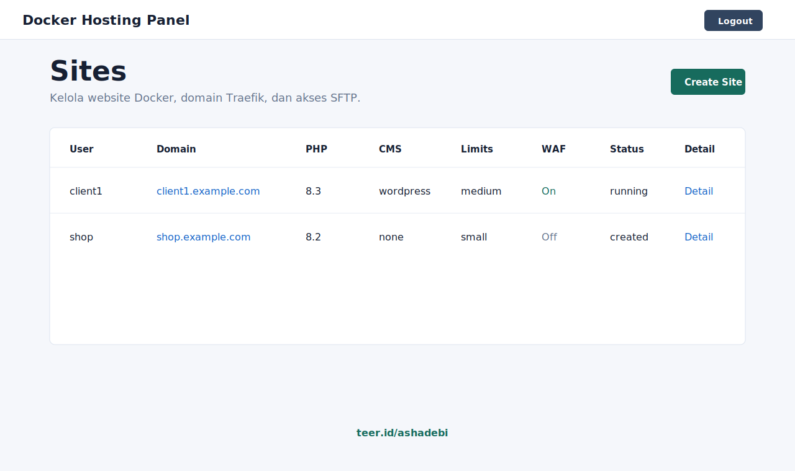
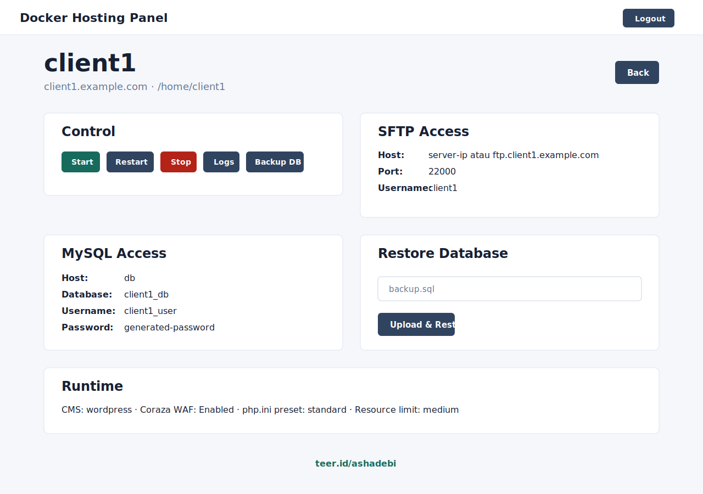

# Kandang Kebo Docker

Docker Hosting Panel for small VPS hosting operations. It provisions one Docker Compose stack per site with Traefik routing, HTTPS, Nginx, PHP-FPM or CMS images, MariaDB, isolated SFTP, backup/restore tools, per-site WAF controls, and multi-user access.

Built for `ashadebi/kandang-kebo-docker`.



## Highlights

- FastAPI + Jinja admin panel with a DockPanel-style dashboard.
- Multi-role login:
  - admin can create, edit, delete, and operate all sites.
  - user accounts can access only their own site panel.
- One Docker Compose project per site.
- Compatible with Docker hosts using `userns-remap`; infrastructure containers that need the Docker socket run with host user namespace while customer site containers remain remapped.
- Per-site containers:
  - Nginx
  - PHP-FPM or CMS image
  - MariaDB
  - isolated SFTP service with its own host port
- Traefik reverse proxy on ports `80` and `443`.
- Automatic HTTP to HTTPS redirect for the panel and hosted sites.
- Automatic Let's Encrypt certificates.
- Optional custom certificate upload per site.
- Global fallback 404 service for unknown hostnames.
- Per-site Coraza WAF controls:
  - enable/disable WAF
  - rate limit per IP
  - SQL injection rules
  - path traversal / LFI rules
  - OWASP CRS / scanner User-Agent blocks
- PHP version selector from PHP 5.6 through PHP 8.4.
- CMS starter selector for WordPress, Joomla, and Drupal.
- Optional custom PHP/CMS image per site.
- `php.ini` presets for standard, large, and very large uploads.
- CPU/RAM resource presets per site.
- Site detail page with generated SFTP and MySQL credentials.
- `.sql` upload and restore into the site's MariaDB container.
- Database backup action from the panel.
- GoAccess/AWStats-style traffic report generation.
- Security dashboard for WAF-enabled sites.
- Permission repair rules for CMS and SFTP compatibility.
- One-command VPS deploy script for fresh Debian servers.
- Footer link: [teer.id/ashadebi](https://teer.id/ashadebi).



## Architecture

```text
internet
  |
  v
Traefik :80/:443
  |
  +-- hosting-dashboard
  +-- hosting-notfound
  +-- site-client1-nginx
        |
        +-- site-client1-php
        +-- site-client1-db
        +-- site-client1-sftp :22000
```

Each site has its own internal Docker network. Only Nginx joins the public Traefik network. PHP-FPM, MariaDB, and SFTP stay isolated inside the site stack.

## Requirements

- Debian 12 or compatible Linux VPS.
- Root SSH access for the deploy script.
- DNS records pointing to the VPS for:
  - the panel domain
  - every hosted site domain
- Public inbound ports:
  - `80/tcp`
  - `443/tcp`
  - configured SFTP ports, starting from `22000/tcp`
- Docker with Compose v2, or let `scripts/deploy-vps.sh` install it.

## Quick Start

Copy `.env.example`:

```bash
cp .env.example .env
```

Edit these values:

```env
PANEL_DOMAIN=panel.example.com
LETSENCRYPT_EMAIL=admin@example.com
ADMIN_USERNAME=admin
ADMIN_PASSWORD=change-this-password
SESSION_SECRET=change-this-long-random-secret
SESSION_IDLE_TIMEOUT_SECONDS=1800
HOST_HOME_ROOT=/home
HOST_PROJECT_ROOT=/opt/docker-hosting-panel
PUBLIC_NETWORK=hosting-public
SFTP_PORT=2222
FALLBACK_HOST_REGEXP=.+
```

Generate SFTP host keys:

```bash
mkdir -p data/sftp
ssh-keygen -t ed25519 -N "" -f data/sftp/ssh_host_ed25519_key
ssh-keygen -t rsa -b 4096 -N "" -f data/sftp/ssh_host_rsa_key
chmod 600 data/sftp/ssh_host_*_key
```

Start the panel:

```bash
docker compose up -d --build
```

Open:

```text
https://PANEL_DOMAIN
```

Default login comes from `.env`:

```text
ADMIN_USERNAME
ADMIN_PASSWORD
```

## One-command VPS Deploy

From your local copy:

```bash
./scripts/deploy-vps.sh root@SERVER_IP SSH_PORT
```

Example:

```bash
./scripts/deploy-vps.sh root@203.0.113.10 22
```

For non-interactive deploys:

```bash
export PANEL_DOMAIN=panel.example.com
export LETSENCRYPT_EMAIL=admin@example.com
export ADMIN_USERNAME=admin
export ADMIN_PASSWORD='change-this-to-a-strong-password'
export SESSION_SECRET='long-random-secret'
export SESSION_IDLE_TIMEOUT_SECONDS=1800
export HOST_HOME_ROOT=/home
export HOST_PROJECT_ROOT=/opt/docker-hosting-panel
export PUBLIC_NETWORK=hosting-public
export SFTP_PORT=2222
export FALLBACK_HOST_REGEXP='.+\.example\.com'

./scripts/deploy-vps.sh root@SERVER_IP SSH_PORT
```

The deploy script will:

- install host requirements
- install Docker CE and Docker Compose v2 on fresh Debian hosts
- upload the project to `HOST_PROJECT_ROOT`
- write `.env` with safe shell-style quoting
- create runtime directories
- generate SFTP host keys when missing
- create the placeholder global SFTP user file when missing
- build and start the Docker stack

During redeploy, the script preserves runtime data:

- `.env`
- `docker-compose.override.yml`
- `data/panel.sqlite`
- `data/letsencrypt/`
- `data/custom-certs/`
- `data/sftp/users.conf`
- generated SFTP host keys
- `traefik/dynamic/site-wafs.yml`

## Directory Layout

When a site is created, the panel creates:

```text
/home/<username>/
  public_html/
  logs/
  goaccess/
  backups/
    database/
    files/
  tmp/
  ssl/
  config/
  compose/
    docker-compose.yml
```

The generated compose file lives inside the site home so each site can be operated independently.

## Site Lifecycle

Admin users can:

- create a site
- edit domain, PHP version, CMS/image, WAF options, php.ini preset, and resource preset
- start, stop, restart, and rebuild a site stack
- upload or remove a custom TLS certificate
- generate traffic reports
- back up the database
- restore a `.sql` file
- delete the site stack and files

Regular users can:

- log in to their own user dashboard
- view and operate only their own site
- access their site's credentials and operational actions

Existing sites are automatically linked to a user account with the same username during database migration.

## SFTP Model

The global `SFTP_PORT` service is kept only as a placeholder for the legacy SFTP container. Real hosted users get isolated SFTP containers per site.

Port allocation starts at `22000`:

```text
first site   -> 22000
second site  -> 22001
third site   -> 22002
```

The site detail page shows the exact SFTP host, port, username, and password.

## Database Backup and Restore

Open a site detail page and use:

- **Backup Database** to create a MariaDB dump under the site's backup directory.
- **Restore Database** to upload a `.sql` file and import it into the site's MariaDB container.

The detail page also shows:

- DB host: `db`
- database name
- database user
- database password

## HTTPS Certificates

Every panel and hosted site HTTP request redirects to HTTPS.

Default behavior:

- Traefik requests and renews Let's Encrypt certificates with the HTTP-01 challenge.
- DNS must point to the VPS.
- Ports `80` and `443` must be reachable from the public internet.

Custom certificate behavior:

- Open the site detail page.
- Upload a PEM certificate/fullchain file and a PEM private key.
- Files are stored under `data/custom-certs/<username>/`.
- Traefik loads them through the dynamic file provider.
- Removing the custom certificate returns the site to automatic Let's Encrypt.

## Coraza WAF

Traefik loads the Coraza plugin and the panel generates per-site dynamic middlewares in:

```text
traefik/dynamic/site-wafs.yml
```

Each WAF-enabled site can use:

- Coraza WAF middleware
- optional Traefik rate limit middleware
- SQL injection rules
- path traversal / LFI rules
- XSS and common scanner rules
- scanner User-Agent blocking for tools such as sqlmap, nikto, nmap, and similar probes

The base Coraza plugin configuration lives in:

```text
traefik/dynamic/coraza-waf.yml
```

The generated `site-wafs.yml` file is runtime state and is intentionally ignored by Git.

## Monitoring

The panel includes:

- dashboard stat cards for CPU, RAM, disk, and container counts
- site container status
- GoAccess report generation from Nginx access logs
- a security dashboard that summarizes WAF-enabled sites

## Permission Rules

Writable web paths:

```text
/home/<username>/public_html
/home/<username>/tmp
```

Rules:

- owner UID/GID: `82:82`
- directory mode: `755`
- file mode: `644`
- applied during create, start, and restart

CMS starters do not receive a default `phpinfo()` index file, so official CMS images can copy their core files into an empty `public_html`.

Drupal is handled specially because the official image stores the full project under `/opt/drupal` and exposes the web directory through `/var/www/html`. On first start, the stack copies Drupal into `/home/<username>/public_html` when `composer.json` is missing, then Nginx serves `/home/<username>/public_html/web`.

## Runtime Data

Do not commit or overwrite these runtime paths:

```text
.env
data/panel.sqlite
data/letsencrypt/
data/custom-certs/
data/sftp/users.conf
data/sftp/ssh_host_*_key
data/sftp/ssh_host_*_key.pub
traefik/dynamic/site-wafs.yml
```

These are either secrets, live database state, certificates, generated middleware, or host-specific keys.

## Security Notes

This panel controls Docker and should be treated like root access.

- Use HTTPS.
- Use a strong admin password.
- Use a long random `SESSION_SECRET`.
- Keep `.env` private.
- Keep `data/panel.sqlite` private.
- Do not commit generated SFTP host keys.
- Restrict panel access by firewall or VPN if possible.
- Patch the host OS and CMS plugins regularly.
- Review WAF rules before relying on them as the only protection layer.

## Health Check

The app exposes:

```text
/healthz
```

Expected response:

```text
ok
```

## Project Notes

Public repository:

```text
ashadebi/kandang-kebo-docker
```

Main deploy script:

```text
scripts/deploy-vps.sh
```
